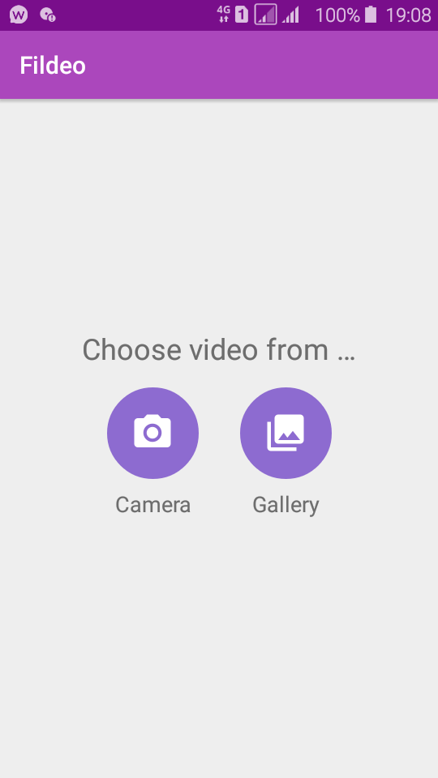
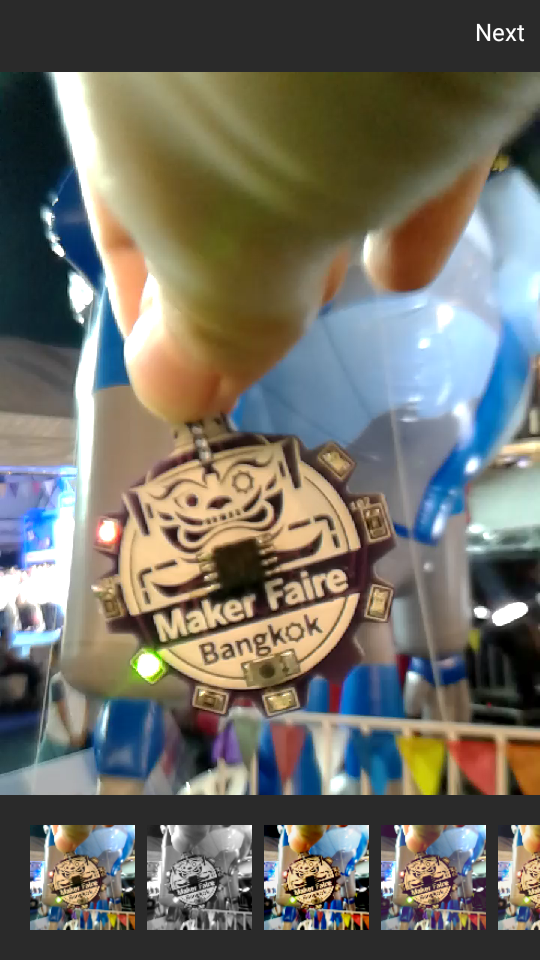
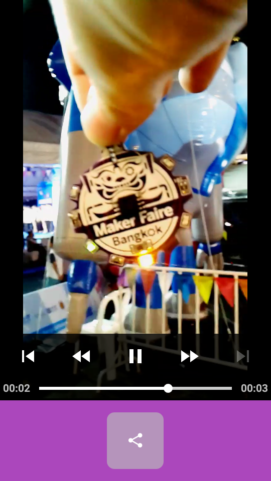
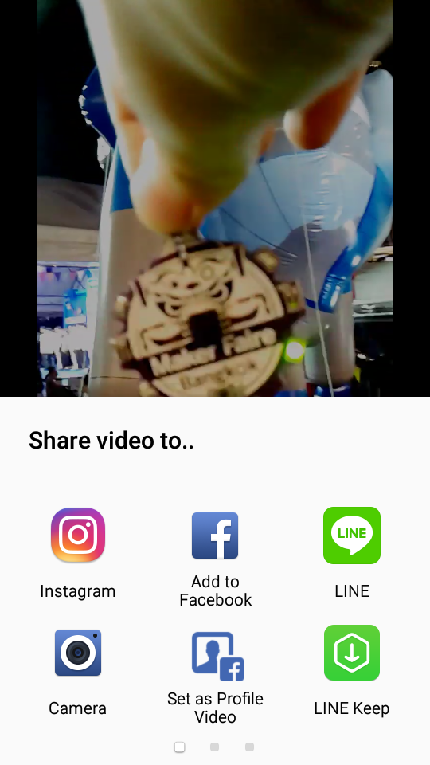

# Fildeo : Video Filter

This project is reused code from my work to new application.

## Feature

- play video with filter
- save video with filter
- share video with filter to some application

## Resource

### Android Library
- ExoPlayer : https://github.com/google/ExoPlayer
- ExoPlayerFilter : https://github.com/MasayukiSuda/ExoPlayerFilter
- Mp4Composer-android : https://github.com/MasayukiSuda/Mp4Composer-android

### Filter
https://www.digitalfilmactions.com/photoshop-curves/

## Blog tutorial
coming soon